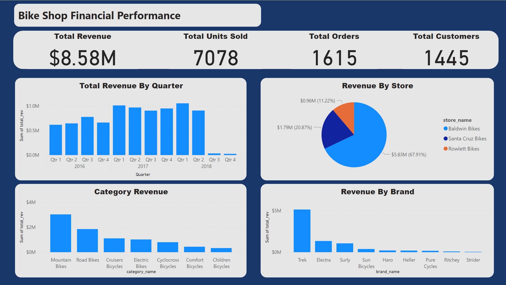
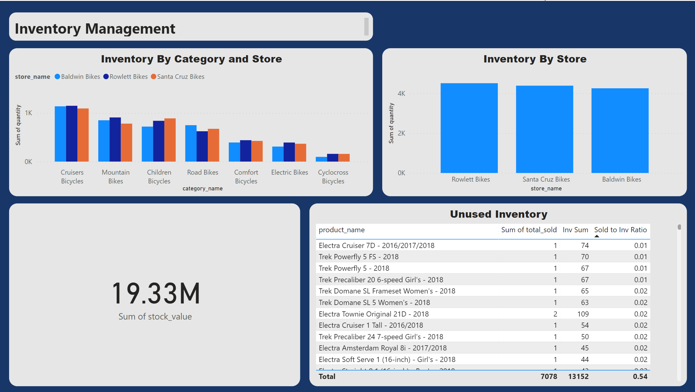
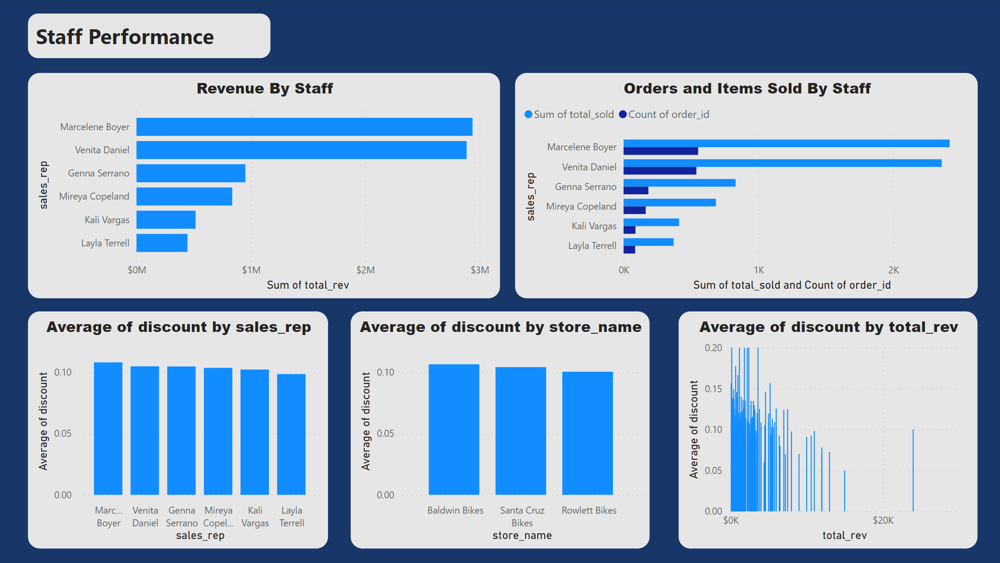

# SQL-Shop-Project
## Bike Shop Financial Review with Power Bi
  
## Introduction:
This is a review of a Bike Shop utilizing SQL queries and Power Bi to visualize.  The project is to analyze the bike shop data and pull insights from the data to answer the clients questions to drive data based decisions to guide the business.  

## Client Requirements 
1.	 What is the overall performance of the shop and is there year over year growth? 
2.	Which store has the highest performance? 
3.	Which category of Bike has the highest revenue?
4.	How much are we carrying in inventory? 
5.	Is the inventory evenly distributed? 
6.	Review of customer purchase trends? 
7.	Should the shop focus on repeat customers or new?  
8.	Review staff performance for key insights?  

## Implementation Strategy and Data Collection: 
 The data was gathered from multiple csv files with each file corresponding to one table of data. A program called quickDBD was used to create the schema for the SQL database.  The model was a Snowflake schema (see below).   The files were uploaded into an SQL database using PostgreSQL.  Using SQL the data was analyzed and then combined to build a dataset with the key information that is suitable for dashboard creating in Power BI.  Used SQL to minimize the data transfer to improve performance of the Power BI evaluation.  The data was extracted into Power Bi and evaluated to provide key insights to meet the client’s requirements.   

The PostgreSQL queries used to organize the data:
[sqlschema](QuickDBD-export.sql) [sqlcleanup](SQLsearchOct112023.sql) [inventory sql](stocksearch.sql) 

  
Database Shema 

##  Analysis of Data
The project report cannot be interacted with on github, the following are screenshots of the some of the dashboards used to evaluate the data to provide insights for the client.   
Dashboards and Visualizations: 
In order or organize the bike shop data and focus on key sections the Power BI review was broken into 4 dashboards, each one focusing on a different area of the clients concerns: 
1.	 Business Financials 
2.	Inventory Management
3.	Customer Focus 
4.	Staff Insights

   
Dashboard:  Financial Performance

   
Dashboard:  Inventory Management

    
Dashboard:  Customer Focus

    
Dashboard:  Staff Performance

##  Clients Requirements and Recommendations:   

