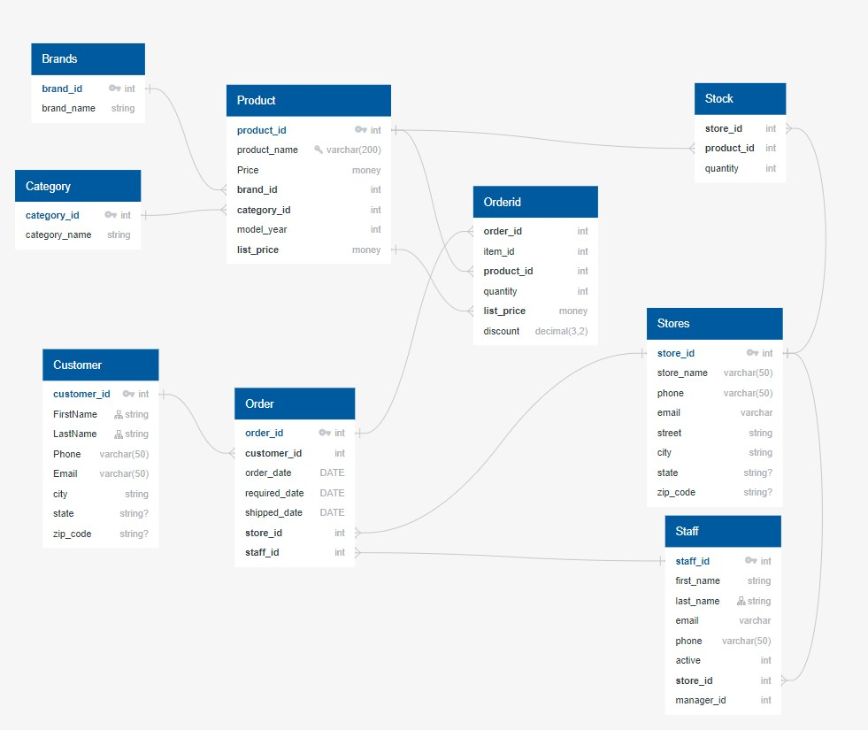

# SQL-Shop-Project
## Bike Shop Financial Review with Power Bi
  
## Introduction:
This is a review of a Bike Shop utilizing SQL queries and Power Bi to visualize.  The project is to analyze the bike shop data and pull insights from the data to answer the clients questions to drive data based decisions to guide the business.  

## Client Requirements 
1.	 What is the overall performance of the shop and is there year over year growth? 
2.	Which store has the highest performance? 
3.	Which category of Bike has the highest revenue?
4.	How much are we carrying in inventory? 
5.	Is the inventory evenly distributed? 
6.	Review of customer purchase trends? 
7.	Should the shop focus on repeat customers or new?  
8.	Review staff performance for key insights?  

## Implementation Strategy and Data Collection: 
 The data was gathered from multiple csv files with each file corresponding to one table of data. A program called quickDBD was used to create the schema for the SQL database.  The model was a Snowflake schema (see below).   The files were uploaded into an SQL database using PostgreSQL.  Using SQL the data was analyzed and then combined to build a dataset with the key information that is suitable for dashboard creating in Power BI.   The data was extracted into Power Bi and evaluated to provide key insights to meet the client’s requirements.   

[sqlschema](QuickDBD-export.sql) [sqlcleanup](SQLsearchOct112023.sql) [sqlschema](stocksearch.sql) 

  

Database Shema 

  

Fig 1: Reactor Process Flow

The 

## Data Preprocessing and Analysis of Data
Quickly

   
Fig 1:  Feature Histogram Raw

   
Fig 2: Feature Histogram Cleaned

The

   
Fig 4: Class Imbalance 

An analysis was conducted to determine if there were relationships between the target value and some of the categorical values.    Fig 5 below show the distribution of build-up cases against the different orifice sizes.  It shows that the build up cases are evenly distributed across all sets of orifices and is more dependent on the number of batches.  Fig 6 below shows the relationship of buildup and formulations.  It shows that the buildup is not consistent to any single formulation and that the number of assurances is also correlated to the number of times the formulation is run (i.e.  more occurrence on formulations that are produced more often).  

 
Fig 5:  Distribution per orifice size

   
Fig 6:  Distribution per Formula

Further review of the data was completed to establish any associations or tends in the data with respect to the target value (build-up).     From Fig 7, Operator controllable Variables Trend, and Fig 8, System or Feedback Variables Trends, there was no obvious indictor or combination of variables that would indicate build-up.  This can be seen from the random True (positive) indicators.  There is no significant grouping or trend area.  This led to the inclusion of all variables (features) in the initial model.   

   

Fig 7:  Operator controllable Variables Trend 

    
Fig 8:  System or Feedback Variables Trends

## Model selection and analysis review

The model was set up as a supervised classification model to determine if the conditions are conducive to buildup in the system.  This was chosen because the build-up conditions are known on past data and it was believed that precise conditions must occur to trigger the build-up.  Supervised learning models are better at precision with limited data and high feature numbers.   The final model chosen was a random forest classifier.  This provided the best performance metrics when evaluating using a combination of confusion matrix, precision, recall, f1 scores and visualized with ROC/AUC curve.  The random forest model was compared to multiple other models including (XGBoost, Decision Tree and KNN) and provided the best results.  The focus was on decision trees due to the fact that decision trees perform better at potential interactions between features. On reactors, multiple variables may have impact on other features. This was confirmed when KNN results provided the lowest scores.    
A pipeline was built to handle the numerical and categorical features.   Due to the multiple features with different units, multiple rows will have to be scaled to limit the adverse effect on the model. While some classifiers can handle the data without scaling there is some evidence that RFC is still impacted by scale.  Categorical encoding included one hot encoding to allow the inclusion of all variables.   
The Grid search and multiple trials were run on random forest model to determine the optimum parameters.   Parameters such as n_estimators, max_depth, min_sample_split, min_sample_leaves and criterion were all evaluated.  The parameters that had little impact on the results were removed in order to minimize computation time.   The model was geared to favor higher recall over precision in the preference. The impact of the false positive is lower than having a false negative. A false positive means slowing the system down unnecessarily while a false negative could lead to buildup and shutdown.  

Results: 
The model performed better than expected.  The accuracy was above 97.5%.  However this is not a good performance indicator due to the imbalanced dataset.   The f1 score was 87.9% and both the recall and precision were above 97%.  This indicates that the both the false negatives and false positive predictions are low as compared to the true positive.   This can be seen in the confusion matrix below Fig 9.  

    
 Fig 9:  Build Model Confusion Matrix

The ROC curve result of 0.97 indicates that the model accuracy is high.  

  
 
A review of the feature importance figure (Fig 11, showed that there was not one or two overriding important features.  It shows 20 features that have similar importance.  This was expected from the correlation in process data previously discussed.   Some of the original features were removed from the model to make it as accurate as possible since the target( build-up) indicator potential was so low in the imbalanced dataset.  Even the smallest change due to the less important features may push it over the edge into a true(build-up) scenario.   

 
  
Fig 11:   Feature importance

#Conclusion and Recommendations / use:   

