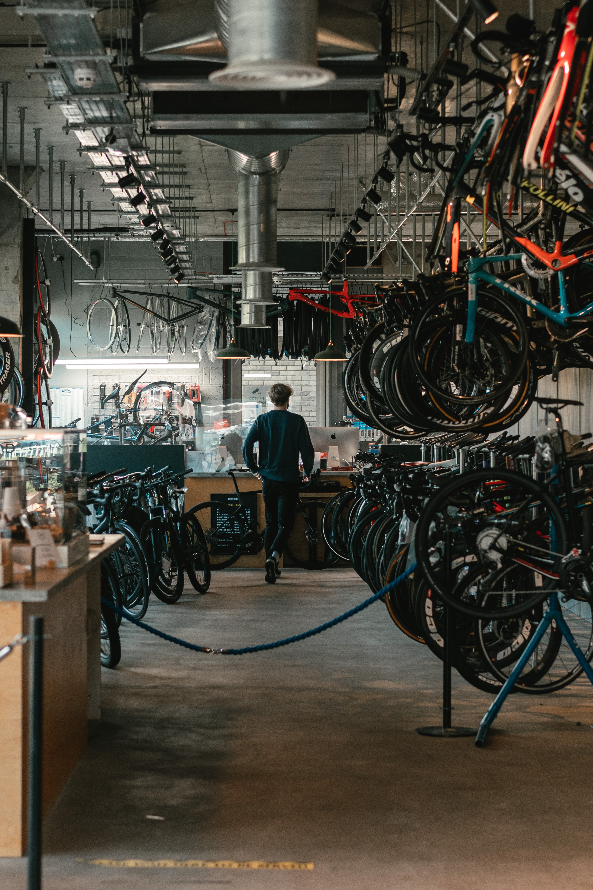

# SQL-Shop-Project
## Bike Shop Financial Review with Power Bi
  
## Introduction:
This is a review of a Bike Shop utilizing SQL queries and Power Bi to visualize.  The project is to analyze the bike shop data and pull insights from the data to answer the clients questions to drive data based decisions to guide the business.  

## Client Requirements 
1.	 What is the overall performance of the shop and is there year over year growth? 
2.	Which store has the highest performance? 
3.	Which category of Bike has the highest revenue?
4.	How much are we carrying in inventory? 
5.	Is the inventory evenly distributed? 
6.	Review of customer purchase trends? 
7.	Should the shop focus on repeat customers or new?  
8.	Review staff performance for key insights?  

## Implementation Strategy and Data Collection: 
 The data was gathered from multiple csv files with each file corresponding to one table of data. A program called quickDBD was used to create the schema for the SQL database.  The model was a Snowflake schema (see below).   The files were uploaded into an SQL database using PostgreSQL.  Using SQL the data was analyzed and then combined to build a dataset with the key information that is suitable for dashboard creating in Power BI.  Used SQL to minimize the data transfer to improve performance of the Power BI evaluation.  The data was extracted into Power Bi and evaluated to provide key insights to meet the client’s requirements.   

The PostgreSQL queries used to organize the data:
[sqlschema](QuickDBD-export.sql) [sqlcleanup](SQLsearchOct112023.sql) [inventory sql](stocksearch.sql) 

  
Database Shema 

##  Analysis of Data
The project report cannot be interacted with on github, the following are screenshots of the some of the dashboards used to evaluate the data to provide insights for the client.   
Dashboards and Visualizations: 
In order or organize the bike shop data and focus on key sections the Power BI review was broken into 4 dashboards, each one focusing on a different area of the clients concerns: 
1.	 Business Financials 
2.	Inventory Management
3.	Customer Focus 
4.	Staff Insights

   
Dashboard:  Financial Performance

   
Dashboard:  Inventory Management

    
Dashboard:  Customer Focus

    
Dashboard:  Staff Performance

##  Clients Requirements and Recommendations:   

1.	What is the overall performance of the shop and is there year over year growth? 
2.	Which store has the highest performance? 
3.	Which category of Bike has the highest revenue?
The first 3 of the client’s requirements focus around company performance and sales perfomance and can be answered from the Financial Performance dash board. From the total revenue by quarter there has been increase in growth year over year in Qtr 1 and that 2017 had increased sales over 2016.  The Store with the highest performance is clearly the Baldwin Bikes store.  Looking further into the data, Santa Cruz Bikes has decreased over the past year except for the last month.  The revenue by brand table show that the Trek models generate a significant amount of the revenue for all stores.  The Mountain bike category leads the revenue push over the past few years but the Electric bike category is increasing for the last 4 quarters.  The comfort style bikes has the lowest revenue per bike sold.  

4.	How much are we carrying in inventory? 
5.	Is the inventory evenly distributed? 
The next two question can be answered with the inventory Management Dashboard.   It is easy to see the total of 19.33 million in inventory.  The inventory is evenly distributed in each store.  Looking further into the data the Cruiser bike category is the highest inventory in every store but has lower sales.  Look at switching from cruiser bikes to electric bikes in inventory.    Road Bikes has the lowest ratio of bikes sold to inventory of bikes.   
6.	Review of customer purchase trends? 
7.	Should the shop focus on repeat customers or new?  
8.	Review staff performance for key insights?  
The last three questions can be answered with the Customer Focus and Staff Performance dashboards.  Looking at the category purchase trend tells us the there was a large number of bikes bought in first quarter of 2018.  Electric bikes sales are picking up at the same time the Cruisers bikes are dropping off.  This may signal a change in customer preference to newer electric bikes.  We should focus on new customers as the majority of sales comes from new.  However, the top spending customers are also repeat customers.   This shows that we are selling to re-distributors.  Two of our employees are outselling the rest by almost 300% but this really has to do more with store location.   Balwin Bikes has the highest Revenue but it is also giving the highest discounts. 

Followup: 
Why did Santa Cruz Bikes sales increase greatly in the past month? 
Review number of bike sold vs revenue, are more people buying a certain type that may have more sales but lower revenue?   
Break down number of bikes sold per category and customer to see if families are buying multiple types of bikes.  
Investigate how many bikes are going to distributors vs families.  Do we want to be selling to re-distributors?   

